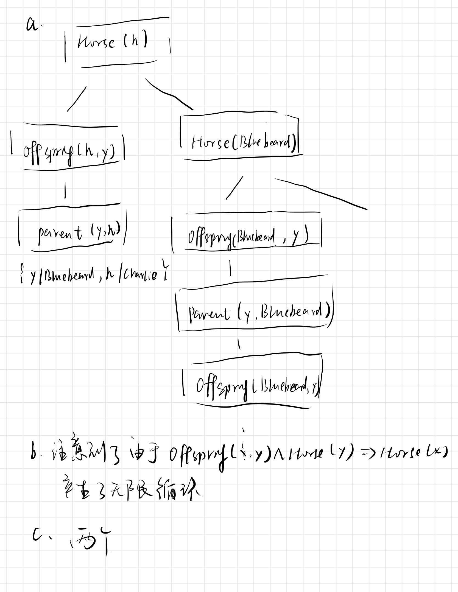

# hw06

> Name:张展翔
>
> Student Number：PB20111669

## 8.24

### a.

$Student(x)$表示 学生x

$Takes(x,c,s)$定义为学生x在s时选取了c课程

故一阶逻辑为$\exist x\ Student(x)\land\ Takes(s,French,Spring2021)$

### b.

$Pass(x,c,s)$定义了学生x在s时通过了课程c的考试

$\forall x,s\ Student(x)\land Takes(x,French,s)\Rightarrow Pass(x,French,s)$

### c.

$$
&\exist x\ Student(x)\land Takes(x,Greek,Spring2021)\land \forall y\\ &y\ne x\ \Rightarrow\ \lnot Takes(y,Greek,Spring2001)
$$

### d.

$Score(x,c,s)$定义了学生x在s时所选课程c的得分，如果$x\gt y$表示x比y分数高
$$
\forall s\ \exist x\ \forall y\ Score(x,Greek,s)\gt Score(y,French,s)
$$

### e.

$Person(x)$表示x这个人

$Buys(x,y,z)$定义了x从z处买了y

$Smart(x)$表示x是聪明的

$Policy(x)$表示保险x
$$
\forall x\ Person(x)\land(\exist y,z\ Policy(y)\land Buys(x,y,z))\Rightarrow \\ Smart(x)
$$

### f.

$Expensive(x)$表示x是昂贵的
$$
\forall x,y,z\ Person(x)\land Policy(y)\land \\Expensive(y)\Rightarrow\lnot Buys(x,y,z)
$$

### g.

$Agent(x)$表示代理x

$Sells(x,y,z)$表示x把y卖给了z

$Insured(x)$表示x没被投保
$$
\exist x\ Agent(x)\land\forall y,z\ Policy(y)\land Sells(x,y,z)\Rightarrow\\ (person(z)\land\lnot Insured(z))
$$

### h.

$Barber(x)$表示理发师x

$Shaves(x,y)$表示x给y理发
$$
\exist x\ Barber(x)\land\forall y\ person(y)\land\lnot Shaves(y,y)\Rightarrow\\ Shaves(x,y)
$$

### i.

$Born(x,y)$表示x再y处出生

$Parent(x,y)$表示x是y的父母

$Citizen(x,c,r)$表示x是因为r而是c公民

$Resident(x,c)$表示x是c的居民
$$
\forall x\ Person(x)\land Born(x,UK)\land(\forall y\ Parent(y,x)\Rightarrow\\((\exist r\ Citizen(y,UK,r))\lor Resident(y,UK)))\\\Rightarrow Citizen(x,UK,Birth)
$$

### j.

$$
\forall x\ Person(x)\land \lnot Born(x,UK)\land(\exist y\\ \ Parent(y,x)\land Citizen(y,UK,Birth))\Rightarrow \\Citizen(x,UK,Descent)
$$

### k.

$Politician(x)$表示x是政治家

$Fools(x,y,t)$x在t时刻愚弄y
$$
\forall x \ Politician(x)\Rightarrow\\
(\exist y\forall t\ Person(y)\land Fools(x,y,t))\land\\
(\exist t\forall y \ Person(y)\Rightarrow Fools(x,y,t))\land\\
\lnot(\forall t\forall y\ Person(y)\Rightarrow Fools(x,y,t))
$$

## 8.17

该定义只考虑了上相邻格和右相邻格没有考虑其他位置，且未处理边界条件

## 9.3

b为合法结果，其中，a中的Everest为对象名不能再属于另一个对象，而c中的Kilimanjaro&BenNevis应用两次实例化了

## 9.4

### a.

${x/A,y/B,z/B}$

### b.

不存在，因为矛盾了

### c.

${x/John,y/John}$

#### d.

不存在，矛盾

## 9.6

### a.

$Horse(x)\Rightarrow Mammal(x)$

$Cow(x)\Rightarrow Mammal(x)$

$Pig(x)\Rightarrow Mammal(x)$

### b.

$Offspring(x,y)\land Horse(y)\Rightarrow Horse(x)$

### c.

$Horse(Bluebeard)$

### d.

$Parent(Bluebeard,Charlie)$

### e.

$$
Offspring(x,y)\Rightarrow Parent(y,x) \\Parent(x,y\Rightarrow Offspring(y,x)
$$

### f.

$Mammal(x)\Rightarrow Parent(G(x),x)$

## 9.13

